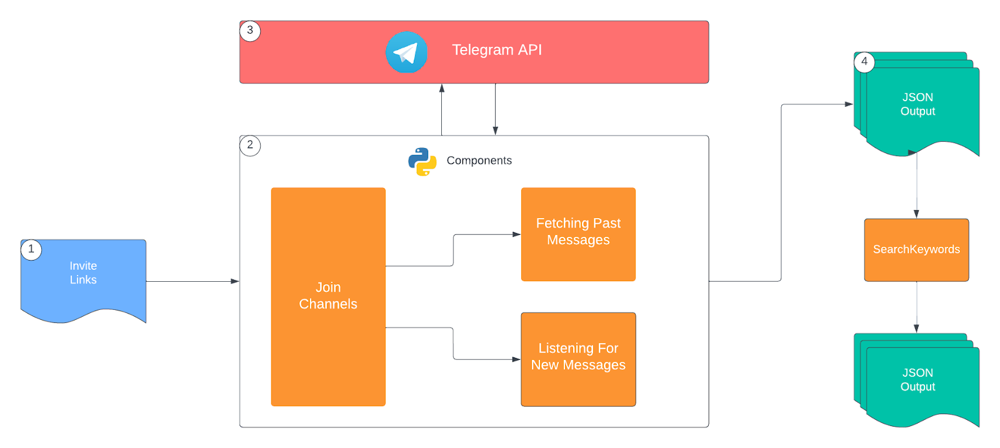
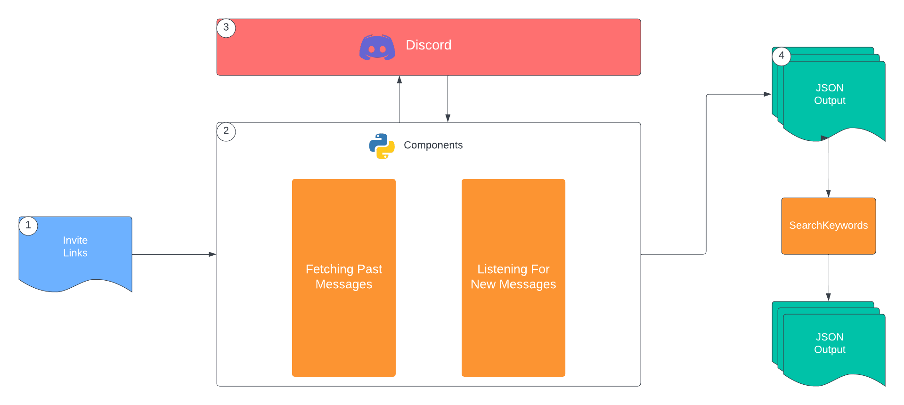
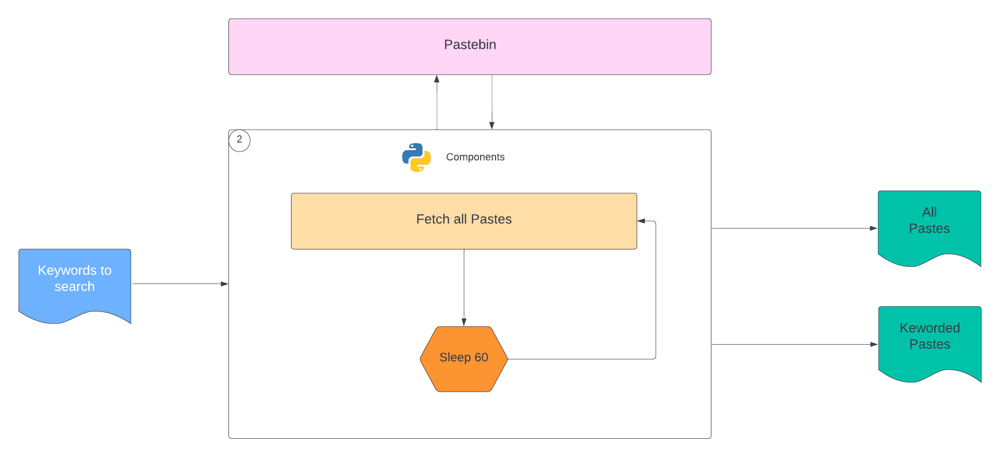

## Name
Deepweb Monitoring Project

## Description
This Project contains tools that are used for deep web monitoring to detect breaches or leaks related to Bobble.

## Architecture
</a>
- Above is the architecture of Telegram Bot of this project.
</a>
- Above is the architectire of Discord Bot of this project.
</a>
- Above is the architectire of Pastebin Bot of this project.

## Installation
Whole project is dockerized, so docker and docker-compose is the only requirement to deploy this project.
```
git clone git@gitlab.com:BobbleResearch/reverse-engineering/telegram-and-discord-bot-darkweb.git
cd telegram-and-discord-bot-darkweb
docker-compose up -d
```

## Usage
Results obtained from these deepweb monitoring tools are stored in the results directory in JSON format, which can be imported into SIEM for further analysis.

## New Updates
```
git clone git@gitlab.com:BobbleResearch/reverse-engineering/telegram-and-discord-bot-darkweb.git
cd telegram-and-discord-bot-darkweb
git branch -M main
git add .
git commit -m "message"
git push -uf origin main
```
